# Rooftop Detection & Attribute Extraction — Design & Reasoning

This document has two layers. The **executive summary** is the one-page version — the sources,
what is and isn't recoverable, and how confidence works. Everything after it is the **detailed
walkthrough**: the pipeline one block at a time, each with the decision I made, the alternative I
rejected, the failure mode, and a figure from the real Karlsplatz run.

---

## Executive summary (the one page)

A rooftop is a 3-D object photographed from directly above, so I fused three open Stadt-Wien
sources that each cover a different blind spot:

- **Orthophoto `lb2024`** (WMTS, 0.1 m, CC BY 4.0) for *appearance* — material, panels, vegetation.
  I chose the city ortho over Sentinel-2 (10 m ≈ 1.4 px per roof — useless for detection) and over
  basemap.at (no advantage here). Vienna's is a **true ortho**, so roof pixels sit on the footprint
  and overlays are trustworthy. I pin the year (`lb2024`) rather than the moving `lb` alias so runs
  are reproducible.
- **ALS DSM − DGM = nDSM** (0.5 m) for *height*. A top-down photo cannot tell a flat roof from a
  pitched one; height can. I deliberately took the raw-value GeoTIFFs (not a WMS hillshade) because I
  need metres to do arithmetic. I query the authoritative 5000 sheet index for tile names rather than
  guessing them.
- **FMZK footprints** (WFS vector) as a *trusted prior* for where each building is.

The height model is the workhorse: I fit **roof planes with RANSAC**, and the facets give **roof
type**, **slope/orientation/height**, and the **superstructures** (pixels sitting >1 m above their
plane). For **appearance** I run a **CLIP ViT-B/32 zero-shot** classifier on each roof crop — no
training data — for **material, solar PV, green roof, condition**.

Reliably recoverable: outline/area, type, slope, orientation, height, superstructures (down to
~1 m), and — with honest confidence — material and PV. **Not** reliably recoverable: fine material
distinctions (terracotta is under-called by CLIP), **green roof** (no NIR in the RGB ortho →
advisory only), and **thermal / insulation** (ECOSTRESS ≈ 70 m per pixel — not resolvable per roof).
I flag these rather than fake them.

Everything is measured in **EPSG:31256** (metres), displayed in EPSG:3857, and exported in EPSG:4326.
Every attribute ships a confidence in `[0, 1]` that is *earned* from the evidence — plane coverage
for structure, CLIP softmax for appearance, valid-pixel coverage and circular concentration for
geometry — so downstream users can threshold per attribute.

---

# Detailed walkthrough

The pipeline runs in this order. Each block below is one stage.

```
0  The fusion thesis            5  Surfaces: nDSM, slope, aspect     10  Geometric attributes
1  Input -> Config -> bbox      6  Orthophoto fetch                  11  CLIP appearance
2  Footprints (WFS / FMZK)      7  Roof detection (height mask)      12  Record + confidence
3  Building selection           8  RANSAC planes -> roof type        13  Outputs & figures
4  DEM tiles (DSM + DGM)        9  Superstructures
```

---

## 0 · The fusion thesis

Every decision in this project descends from one observation: **no single open source sees a roof
completely.**

| Source | Sees | Blind to |
| --- | --- | --- |
| Footprint (FMZK) | *where* the building is | anything about the roof itself |
| Height model (nDSM) | the roof's 3-D shape | colour, material, texture |
| Orthophoto | colour and texture | height — a flat and a pitched roof look identical from above |

So the design is a deliberate **three-source fusion**: the footprint anchors *where*, the height
model gives *structure*, the photo gives *appearance*, and **each attribute is extracted from the one
source that can actually see it**. When I later say "roof type comes from height, not from the photo,"
this table is why. It is also why the honest failure cases are *seams between sources* — most
sharply, when the height model and the photo were captured years apart (see Block 7).

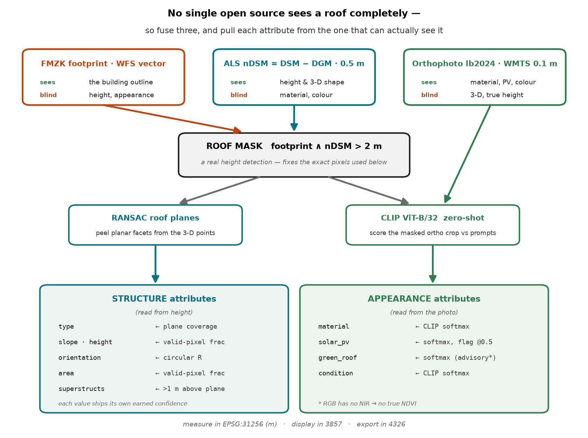

**Reading the diagram.** The three open sources sit at the top, each labelled with what it *sees* and
what it is *blind to*. They don't feed the outputs directly — they converge first on the **roof mask**
(`footprint ∧ nDSM > 2 m`), a genuine height-based detection that fixes the exact pixel set everything
downstream reads. From there the pipeline splits cleanly: the mask + height drive **RANSAC** →
*structure* attributes (type, slope, orientation, area, superstructures), while the mask + orthophoto
drive **CLIP** → *appearance* attributes (material, PV, green roof, condition). Every attribute is
tagged with **where its confidence comes from** — plane coverage, circular R, valid-pixel fraction, or
a CLIP softmax — which is the thread that runs through the whole walkthrough: nothing is asserted
without evidence, and the numbers are measured in metres (EPSG:31256), displayed in 3857, exported in
4326.

---

## 1 · Input → Config → bounding box

**What it does.** The entry point is `python -m roofkit --location karlsplatz`. The first thing worth
stating plainly, because it is a correctness point people miss: **the unit of input is a rectangle,
not a point.** `Config.at("karlsplatz")` looks up four numbers — the SW and NE corners of a box in
plain GPS coordinates (EPSG:4326):

```python
"karlsplatz": (16.3676, 48.1978, 16.3689, 48.1987)   # west, south, east, north
```

Every knob that shapes a run lives in one `Config` dataclass next to those corners: how many
buildings to sample (`n_buildings`), the random `seed`, the ortho year and zoom, and the physical
thresholds the later blocks depend on — `roof_min_h = 2.0 m`, `flat_thresh = 10°`,
`plane_tol = 0.3 m`, `min_facet_px = 30`. Nothing that affects a result is buried deeper in the code;
the entire run is reproducible from this one object.

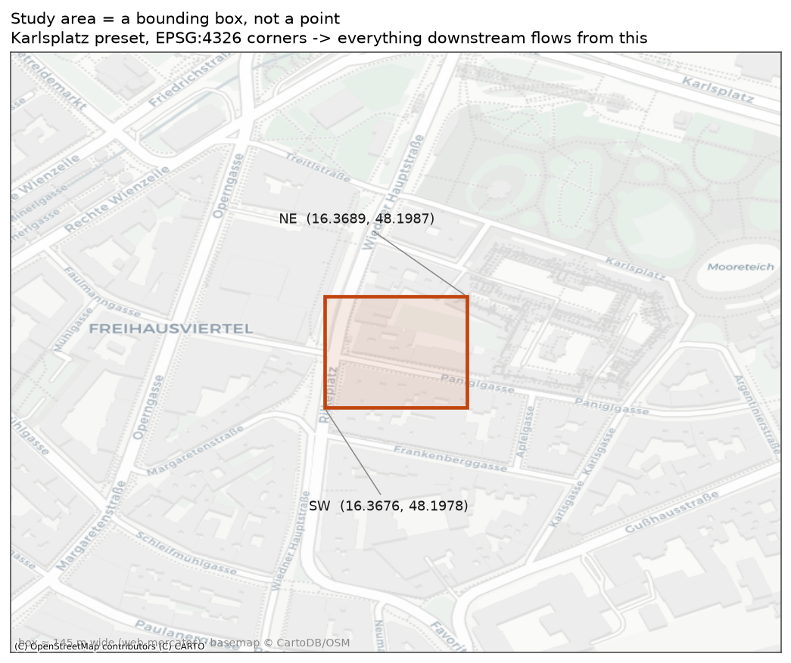

**Why a box, not a point.** The obvious alternative — "give me a lat/lon and I'll find the building
there" — forces the code to *guess* which building you meant and how far around the point to look. A
box makes the area of interest **explicit and reproducible**, and it is the natural unit for the real
goal in the brief: *scale to thousands of buildings.* You scale by tiling a city into boxes, not by
clicking points. The three named presets are chosen to stress different conditions on purpose:
`karlsplatz` (dense Gründerzeit blocks where the height model and photo agree), `sonnwendviertel` (a
new-build district where the height model is **older** than the photo — my honest failure case), and
`museumsquartier` (mixed historic and modern).

**Why lon/lat here specifically.** The box is in degrees (EPSG:4326), but nothing is ever *measured*
in degrees. 4326 is only the portable interchange format; the corners are converted to metres
(EPSG:31256) the instant real work begins, in Block 2. This is the first appearance of a rule I hold
throughout: **4326 to talk to the outside world, 31256 to measure, 3857 to display** — three
coordinate systems, three jobs, never mixed. Measuring in degrees would make an "area in m²" or a
"0.3 m plane tolerance" meaningless, because a degree of longitude at 48° N is not a fixed number of
metres.

**The failure mode.** Two things break here. A box that is too large samples buildings spread across
many DEM tiles — slow, large downloads; too small and there is nothing to sample. More subtly,
because the thresholds live in `Config`, a *wrong constant* degrades every building at once and
silently: set `roof_min_h` too high and low buildings vanish from detection with no error raised. The
config is both the reproducibility win and the single place where one bad number poisons the whole
run — which is exactly why every such number is named and defaulted here rather than sprinkled through
the code.

> _Next: Block 2 — turning this box into building footprints via the WFS, and why F_KLASSE == 11._

---

## 2 · Footprints from the WFS (the "where" prior)

**What it does.** `fetch_footprints(west, south, east, north)` turns the box into a set of trusted
building outlines. The FMZK — *Flächen-Mehrzweckkarte*, Vienna's authoritative large-scale base map —
publishes its building layer `FMZKGEBOGD` as **open data over a WFS** (Web Feature Service, the OGC
standard for serving *vector* geometry, as opposed to WMS/WMTS which serve *pixels*). The function:

1. Converts the lon/lat box corners to metres (`_TO_METRE`, 4326 → 31256) **before** building the
   request, so we ask the server for data in the same CRS we will measure in.
2. Builds a `GetFeature` URL: `typeName=ogdwien:FMZKGEBOGD`, `srsName=EPSG:31256`,
   `outputFormat=json`, and a `bbox=` in metres. `geopandas.read_file(url)` reads the returned GeoJSON
   straight into a GeoDataFrame.
3. **Asserts** the CRS came back as 31256 — a one-line guard (`assert gdf.crs.to_epsg() == EPSG_M`).
4. Filters to **`F_KLASSE == 11`** (the FMZK class code for above-ground buildings) and computes each
   polygon's `area` in real m² (valid because we're in a metre CRS), then keeps only those
   **> 60 m²**.

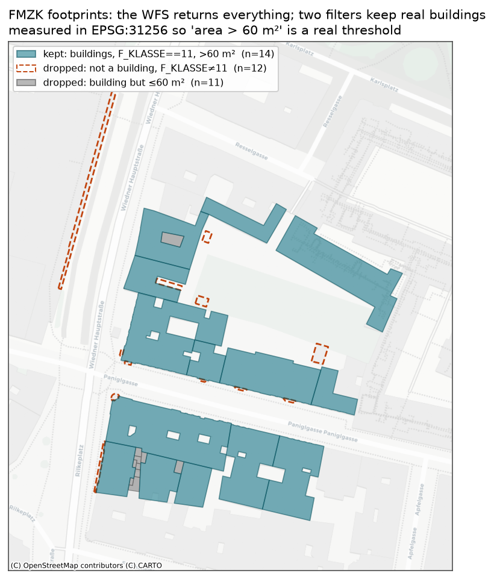

On the real Karlsplatz box that chain is doing visible work: the WFS returns **37** polygons; the
class filter drops **12** non-building features (canopies, sub-surface and boundary polygons — dashed
red), the area filter drops **11** slivers ≤ 60 m² (grey), and **14** real buildings survive (teal).
Notice the buildings already have their inner courtyards punched out as polygon *holes* — FMZK is
good, but not perfect at this, which is exactly why Block 7 still re-derives the roof from height
rather than trusting the footprint interior.

**Why this and not the alternative.** The obvious free footprint source is **OpenStreetMap**. I chose
FMZK deliberately: it is the city's own cadastral-grade layer with a **consistent `F_KLASSE` schema**,
guaranteed coverage, and a clear CC BY licence — so the "where" prior is *trustworthy and uniform*
across the whole city. OSM is crowd-sourced, inconsistent in completeness and tagging, and carries no
building-class field, so I would inherit its gaps. For a component meant to scale to thousands of
buildings, a uniform authoritative prior beats a patchy one. I also filter **server-side by bbox**
rather than downloading a city layer and cropping locally — only the features I need cross the wire,
which is what makes the per-box design scale.

**Why the CRS assertion earns its line.** WFS servers are allowed to *ignore* `srsName` and return
their native CRS. If this one silently handed back EPSG:4326, every downstream area, the 60 m² cutoff,
the 0.3 m plane tolerance — all of it — would be computed in degrees and be silently, catastrophically
wrong, with **no error raised**. The `assert` converts a silent data-corruption bug into a loud,
immediate failure. It's the cheapest insurance in the pipeline.

**The failure mode.** The two filters are blunt by design. The 60 m² cutoff will drop a genuinely
tiny building (a kiosk) and would keep a large canopy if it were mis-tagged as class 11 — it's a
heuristic tuned for the brief's "8–10 substantial buildings," not a universal truth. And the whole
block trusts FMZK's classification: a building the city mis-coded would never enter the pipeline.
Because the footprint is only the *prior* — Block 7 re-detects the roof from height inside it — a
slightly wrong outline is recoverable, but a *missing* building is not. That's an acceptable trade for
this task and one I'd revisit for a full-city run (e.g. union FMZK with OSM to catch each other's
gaps).

> _Next: Block 3 — sampling which buildings to process, and why the seed matters._

---

## 3 · Building selection (which roofs get processed)

**What it does.** `pick_buildings(gdf, n, seed)` is one line —
`gdf.sample(n=min(n, len(gdf)), random_state=seed).reset_index(drop=True)` — a **seeded random
sample** of the kept footprints. On the Karlsplatz box it draws **10 of the 14** survivors.

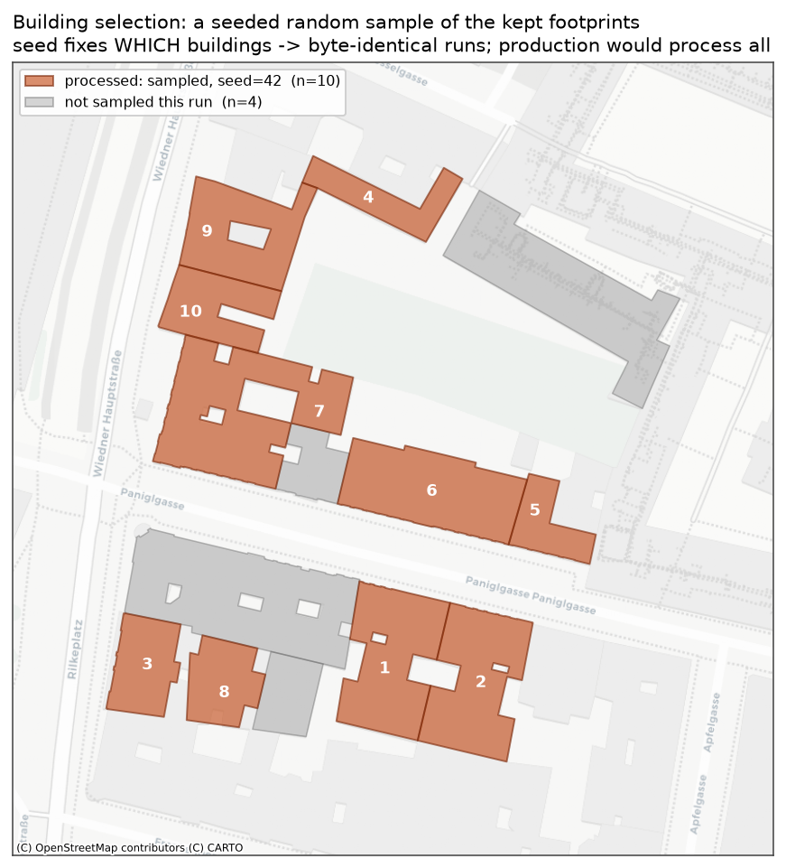

**Why sample at all — and why *random*.** The brief asks for 8–10 buildings, so this is a
*demonstration* affordance, not the production path: at city scale you would drop the sampling and
process every footprint. But the choice of *how* to pick the demo set is itself a judgement call. I
sample **uniformly at random** rather than hand-picking ten photogenic roofs, and that's deliberate:
cherry-picking would inflate the apparent quality and hide the cases the method struggles with. A
random draw means the reported numbers are honest — whatever mix of flat, pitched, clean and messy
roofs the area actually contains is what gets scored.

**Why the seed earns its place.** `random_state=42` fixes *which* ten buildings are drawn, so every
run produces a byte-identical selection — and therefore identical JSON and identical figures. A
reviewer who clones the repo and runs it gets exactly what I got; nothing shifts under them. Changing
the seed is also my cheap **robustness probe**: re-running with `--seed 7` re-rolls the sample onto a
different set of roofs, which is how I check the pipeline isn't quietly overfit to one lucky draw. The
`min(n, len(gdf))` guard means a box with fewer than `n` buildings simply takes all of them instead of
crashing.

**The failure mode — and an honest subtlety.** Two things. First, uniform random can *miss the
interesting building* — if only one roof in the box has solar panels, a random ten might skip it; the
sample is representative, not curated, which is the point but also a limitation for showcasing. For a
formal evaluation I'd **stratify** by building type or size rather than sample uniformly. Second, the
reproducibility is subtler than it looks: `sample(random_state=seed)` picks rows *by position*, so
byte-identical results depend on the **WFS returning features in a stable order**. If Vienna ever
reorders that layer, the same seed would select a different ten. It holds in practice, but I wouldn't
claim it as a guarantee — the honest statement is "reproducible given a stable upstream feature order."

> _Next: Block 4 — fetching the height model: the DSM and DGM tiles, resumable downloads, and querying
> the sheet index instead of guessing filenames._

---

## 4 · The height model — DSM and DGM tiles

**What it does.** This block fetches the two raster surfaces the whole "structure" half of the project
rests on:

- **DSM** (`dom`, *Digitales Oberflächenmodell*, 0.5 m) — the **surface** as the laser scanner saw it,
  including roofs, trees, everything on top.
- **DGM** (`dgm`, *Digitales Geländemodell*, 1 m) — the **bare ground**, with buildings and vegetation
  stripped out.

The difference between them is height above ground — but that subtraction is the *next* block. Here
the job is just getting the pixels, and it's three functions:

1. **`dem_sheets_for(bounds)`** — Vienna tiles its elevation data into 1:5000 map sheets. Rather than
   guess which tile I need, I query the **authoritative sheet index** (`MZKBLATT5000OGD`, another WFS
   layer) with my bounds and it returns the sheet IDs. On this box it returns **two** — `['35_4',
   '45_2']` — because the ten buildings straddle a sheet boundary. That's the whole argument for
   querying rather than hard-coding: I didn't have to know, or care, that this area spans two tiles.
2. **`_sheet_tif(sheet, model)`** — downloads and caches one tile. If it's already on disk (`data/
   dem_cache/`), return it. Otherwise `curl` fetches the zip **resumably** and I validate it before
   trusting it (see below), unzip, and cache.
3. **`get_dem(model, sheets, bounds)`** — opens the needed tiles, **mosaics** them into one array with
   `rasterio.merge`, crops to the buildings' bounds **plus a 40 m margin**, converts the tiles' nodata
   value to `NaN`, and returns `(array, transform)`.

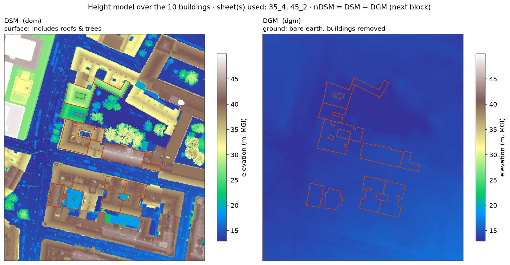

The figure makes the two surfaces concrete: on the **DSM** the roofs and trees stand up out of the
street (browns/greys are tall, greens are tree canopy, blue is low ground); on the **DGM** the same
footprints enclose nothing but smooth terrain — the buildings have been removed. Subtracting the right
from the left is what isolates the roofs, and that's Block 5.

**Why raw GeoTIFFs, not a WMS hillshade.** Vienna also serves pretty pre-rendered relief images. I
deliberately took the **raw-value GeoTIFFs** because I need to do *arithmetic in metres* — `DSM − DGM`,
"is this pixel > 2 m above ground," "fit a plane within 0.3 m." A hillshade is a *picture* of the
terrain; you cannot subtract two pictures and get a height. The raw values are the difference between
a dataset you can *measure* and one you can only *look at*.

**Why query the sheet index instead of guessing filenames.** The naïve approach hard-codes tile names
or infers them from a pattern. That breaks the moment a study area spans two sheets (exactly this
case), or the city renames a tile. Asking the index "which sheets cover these bounds?" makes the
fetcher correct by construction and self-maintaining.

**The resumable-download war story.** Vienna's DEM download server **drops the connection mid-stream**
on these zips — a plain download fails intermittently. So `curl` runs with `--retry 10
--retry-all-errors` and `-C -` (resume from where it broke) and a `--max-time` ceiling. Then, before I
trust the file, I check it contains the ZIP **end-of-central-directory marker** (`PK\x05\x06`) — a
truncated download is caught *here*, with a clear message, instead of surfacing later as a baffling
"not a zip file" error deep in the unzip. This is the kind of robustness that separates a script that
worked once on my machine from one a reviewer can actually run.

**The failure mode.** Three real ones. (1) The DSM and DGM are on **different grids and resolutions**
(0.5 m vs 1 m — you can see the shapes differ, 418×370 vs 209×185), so they *cannot* be subtracted
directly; Block 5 has to regrid one onto the other first. (2) **nodata handling matters** — if the
tiles' nodata sentinel weren't converted to `NaN`, those holes would read as real elevations and
poison every height statistic; capturing the nodata value *before* the source files are closed is a
deliberate ordering, not an accident. (3) The DEM has a **capture date**; where it predates the ortho
(redeveloped land) the height is simply wrong for the current building — the temporal-gap problem that
Block 7 detects and flags.

> _Next: Block 5 — nDSM = DSM − DGM, and deriving slope and aspect from the height gradient._

---

## 5 · Surfaces — nDSM, slope, aspect

**What it does.** `compute_surfaces(dsm, dsm_tf, dgm, dgm_tf)` turns the two raw tiles from Block 4
into the **three arrays the entire structure half of the pipeline reads from**:

1. **Regrid the DGM onto the DSM grid.** The ground model is 1 m and the surface model is 0.5 m — a
   different grid — so I `reproject` the DGM onto the DSM's grid with **bilinear** resampling. Bilinear
   because *elevation is continuous*: interpolating a smooth height surface is correct, and it's the
   counterpart to the *nearest*-neighbour resampling I use later for masks (Block 7), where
   interpolating a category would be nonsense.
2. **nDSM = DSM − ground** — height above terrain, now that both are on the same grid.
3. **slope and aspect** from the DSM's gradient (`np.gradient` at 0.5 m spacing): `slope` = the angle
   off horizontal, `aspect` = the compass direction the pitch faces
   (`arctan2(-gx, gy) % 360`, the same convention the RANSAC planes use in Block 8 so the two agree).

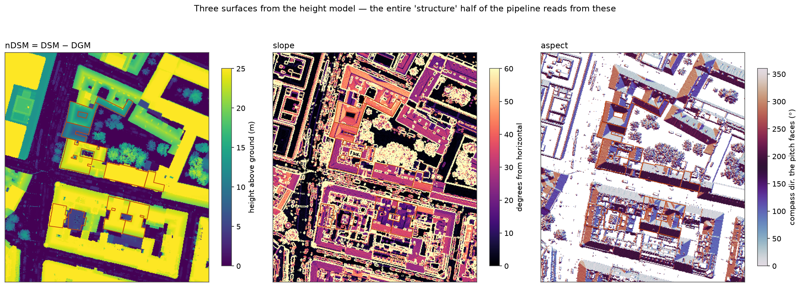

Read the figure left to right — this is the payoff of Blocks 4–5:

- **nDSM**: buildings now stand at their true height above ground (yellow ≈ 15–25 m), the street is
  ~0 (dark), trees sit in between. The tallest pixel in view is **59 m** (a spire). This single array
  is what makes "roof vs. yard" decidable in Block 7.
- **slope**: flat roof *interiors* are dark (near 0°); pitched facets and every building *edge* are
  bright. Notice the crisp bright outlines around each footprint — those are the DSM "cliffs" at
  building walls, and they're a warning sign I deal with below.
- **aspect**: each pitched facet takes a compass colour, so a gable roof shows as **two opposite
  colours** (its two sides facing opposite ways). I blank aspect wherever the roof is flat or low —
  a direction for a flat surface is meaningless.

**Why bilinear here, nearest later.** This is one consistent rule stated once: **interpolate
continuous fields, never interpolate categories.** Height is continuous, so the DGM gets bilinear
resampling. A roof *mask* (Block 7) is a yes/no category, so it gets nearest-neighbour — a bilinear'd
mask would invent fractional "0.5 roof" pixels along every edge. Getting this backwards is a classic
geospatial bug; calling it out is worth a sentence.

**Why per-pixel slope/aspect at all, given RANSAC comes later.** These pixel-level fields are the raw
material for the *summary* geometry in Block 10 (median slope, circular-mean orientation), and for
blanking decisions like the one above. They are deliberately **not** how I decide roof *type* — that
needs the robust, multi-pixel view RANSAC gives (Block 8), precisely because per-pixel slope is noisy.

**The failure mode — edge artefacts and flat-roof aspect.** Two real ones, both visible in the figure.
(1) At building walls the DSM steps vertically, so its gradient *explodes* — those bright outlines are
slopes of 60°+ that are an artefact of the footprint edge, not a real roof pitch. I neutralise this by
measuring geometry over the roof *interior* mask and using **medians** (robust to the edge spikes),
and by using RANSAC rather than raw slope for type. (2) **Aspect is pure noise on a flat roof** —
`arctan2` of two near-zero gradients — which is why I blank it in the figure and why the output record
sets `orientation_deg = None` for flat roofs instead of reporting a confident random compass bearing.

> _Next: Block 6 — the orthophoto: the WMTS fetch, the true-ortho choice, and pinning the year._

---

## 6 · The orthophoto — appearance source

**What it does.** `fetch_ortho(chosen, ortho_year=2024, zoom=20)` gets the RGB photo that the CLIP
classifier will read in Block 11. It reprojects the chosen buildings to EPSG:3857, takes their bounds
plus a 25 m pad, and asks Vienna's **WMTS** tile service for that area:

```
https://maps.wien.gv.at/wmts/lb2024/farbe/google3857/{z}/{y}/{x}.jpeg
```

`contextily.bounds2img(..., zoom=20)` downloads and stitches the tiles into one `1792 × 1792 × 3`
image at ~0.1 m/pixel, and I build an `ortho_transform` so I know exactly which metre coordinate each
pixel maps to. Note the protocol: footprints came over **WFS** (vectors, Block 2) because I needed
geometry; the photo comes over **WMTS** because I need *pixels*.

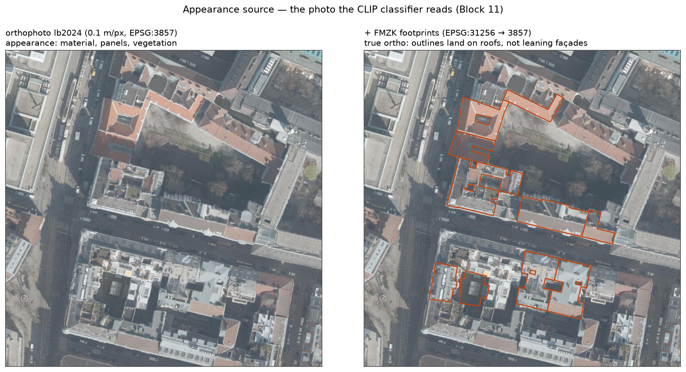

**Why the *true* ortho is the whole game.** A normal aerial photo has perspective: a tall building
*leans* away from the camera, so its roof appears shifted off the ground it actually sits on
("layover"). If I overlaid a footprint on a normal photo, the outline would land on the leaning façade,
not the roof. Vienna publishes a **true orthophoto** — geometrically corrected with the surface model
so every pixel is placed as if viewed straight down. The right panel is the proof: the FMZK footprints
(measured in 31256, reprojected to 3857) land **on the roofs**, not beside them. This is what lets
Block 7 take a roof mask derived from *height* and reproject it onto the *photo* to sample the correct
roof pixels. Without a true ortho I'd need an explicit layover correction; with it, alignment is free.

**Why pin `lb2024` and not the moving `lb` alias.** Vienna also serves a "latest" alias that silently
advances each year. Pinning the explicit year means the same run returns the **same photo** forever —
reproducibility again. A moving alias would make results drift between runs for no visible reason,
which is exactly the kind of irreproducibility that erodes trust in a pipeline.

**Why zoom 20.** ~0.1 m/pixel is enough to resolve roof texture, solar panels, and larger
superstructures for the classifier; going higher just multiplies tiles and download time with no
information gain.

**The failure mode.** (1) The ortho is in **EPSG:3857**, a *display* CRS whose scale is distorted at
Vienna's latitude — so I never *measure* on it. Area is measured on the 31256 nDSM grid; the ortho is
only ever sampled for colour. Keeping 3857 as display-only is the deliberate boundary. (2) **Shadows,
tree overhang and occlusion** are baked into a single flight — deep courtyard shadows (visible here)
can hide roof detail from CLIP, and a leaf-on flight can mask or mimic a green roof. (3) The ortho has
a **capture date** that can differ from the DEM's — the temporal seam again, handled in Block 7.

> _Next: Block 7 — roof detection: turning the footprint + nDSM into a height-derived roof mask, and
> why that's a real detection, not a segmentation model._

---

## 7 · Roof detection — the height mask

This is the conceptual heart of the project: **how the roof is actually detected.** No segmentation
model, no training — the roof extent is decided by the height data itself.

**What it does.** `roof_from_height(geom, dsm_transform, ndsm, roof_min_h=2.0, min_facet_px=30)`:

1. Rasterises the footprint's **outer ring** onto the DSM grid → `full`. Not the raw footprint: I first
   drop the interior rings (`_fill_holes`), so FMZK's mapped courtyards and light wells are *filled in*
   and the decision about what's inside them is handed to **height**, not taken on trust from the
   outline (see "the outer-ring fix" below).
2. The one line that matters: `roof = full & isfinite(ndsm) & (ndsm > 2.0)`. Keep only the pixels that
   are *inside the outer ring* **and** *more than 2 m above the ground*. That intersection is the
   detection.
3. **Fallback:** if that leaves fewer than 30 pixels (a genuinely low building, or a DEM hole), relax
   to `full & isfinite(ndsm)` so the building still produces something rather than vanishing.
4. Polygonise the mask (`rasterio.features.shapes`), union the parts and `simplify(0.3)` → a roof
   *outline*; the area is just the roof pixel count × 0.25 m².

Two more functions carry the mask across to the photo for Block 11: `roof_mask_on_ortho` reprojects
the 31256 mask onto the ortho's 3857 grid with **nearest-neighbour** (the mask is categorical — the
Block 5 rule), and `crop_to_roof` cuts the ortho to the roof's bbox and blacks out every non-roof
pixel so CLIP sees roof and nothing else.

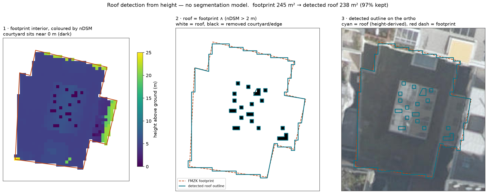

**Reading the figure (and the honest 97%).** Panel 1 colours the footprint interior by height: the
roof surface sits at one level and the little dark squares are **light wells / air shafts** that drop
to near ground. Panel 2 applies the > 2 m rule — white is roof, and those light wells (plus the thin
overhang at the edges) turn black, *removed*. Panel 3 lays the resulting cyan outline on the photo; it
traces the actual roof. The headline number is deliberately unspectacular: **245 m² → 238 m², 97%
kept.** I show that rather than cherry-picking a dramatic courtyard, because it tells the truth about
this data: **FMZK is good** — on a well-mapped Gründerzeit block it already punches the big central
courtyards out as polygon holes, so the height mask's visible job here is trimming the *residual* light
wells and roof-edge overhang.

**The outer-ring fix (a real false-negative I found and closed).** The original mask rasterised the
footprint *with its holes*, trusting FMZK's interior rings blindly. Inspecting one building broke that
assumption: FMZK maps a ~36 m² light well at the roof's centre, but a **solar-panel array is physically
mounted over that opening** — so the hole vetoed the panel pixels and they were masked out **despite
sitting at 11 m**, guaranteeing `solar_pv = false` before CLIP ever saw them. The fix is to rasterise
the **outer ring** (holes filled) and let the > 2 m height test arbitrate every opening: a genuinely
open courtyard still drops out (its nDSM ≈ 0), but a *covered* structure the footprint mis-mapped as a
hole (the light-well platform at 11 m) is correctly kept. The height model already knew the hole was
covered; the old code just never asked. After the fix the panels survive to CLIP and PV fires — see
Blocks 8 and 11.

**So why does the mask still earn its place, if it only removes 3% here?** Three reasons:

1. **It is a real detector, not a copy of the footprint.** The roof *extent* is decided by the height
   data, not asserted from the outline. Where the footprint disagrees with reality — an un-punched
   courtyard, a demolished wing, a canopy — the height mask, not the footprint, wins.
2. **It defines the exact pixel set everything downstream consumes.** RANSAC (Block 8), the
   superstructure search (Block 9), the geometry medians (Block 10) and the CLIP crop (Block 11) all
   read *these* pixels. Getting the roof/not-roof boundary right here is what keeps a courtyard or a
   neighbouring tree out of every later measurement.
3. **It needs no model and gives 3-D for free.** A threshold on height is fully explainable and
   training-free, and because each kept pixel already carries a height, the same mask hands RANSAC its
   3-D point cloud at no extra cost.

**Why not SAM / a learned segmentation model** *(a dead-end I considered).* Tempting, but the task is
attribute *extraction*, not instance masks; a learned segmenter would need a model and weights, would
produce a flat 2-D mask with **no height**, and would be far harder to justify pixel-by-pixel. A height
threshold is simpler, explainable, and doubles as the structure source. I rejected segmentation on
purpose, not for lack of it.

**The failure mode.** (1) The **temporal gap**: on redeveloped land the nDSM under a real new building
is ~0, so the > 2 m rule finds nothing, the fallback keeps the bare footprint, and the near-zero height
is my flag that the DEM predates the building — I surface it rather than emit a confident wrong roof.
(2) An **overhanging tree** taller than 2 m that crosses the footprint edge can be caught as roof;
bounded because only *inside*-footprint pixels are eligible. (3) The threshold is a knob: too high drops
low buildings, too low lets parapets and wall-adjacent clutter in. 2 m is "above head height," a
defensible ground-vs-roof cut, and it's in the config.

> _Next: Block 8 — RANSAC plane fitting: turning the roof's 3-D points into facets, and the facets into
> a roof type._

---

## 8 · RANSAC plane fitting — roof type

Block 7 gave a set of roof pixels, each already carrying a height. Block 8 treats **every roof pixel
as a 3-D point** `(x, y, height)` and asks: how many flat planes does this roof break into, and which
way does each face? That answers **roof type**, and — importantly — the answer comes with an *earned*
confidence.

**What it does.** Three layers:

1. **`fit_plane(xy, z)`** — least-squares fit of one plane `z = a·x + b·y + c` through a set of points.
2. **`ransac_plane(xy, z, tol=0.3)`** — RANSAC = **RA**ndom **SA**mple **C**onsensus. Repeat 200 times:
   pick 3 random points (3 points define a plane), and count how many of *all* the points fall within
   0.3 m of it. Keep the plane the most points agree with. The power of this is **robustness**: a
   chimney or a bit of noise doesn't fit the roof plane, so it's simply not counted as an inlier — it
   can't drag the fit off, the way it would in a plain least-squares fit over the whole roof.
3. **`fit_roof_planes(...)`** — *sequential* RANSAC. Find the dominant plane, bank it, **remove its
   pixels**, and repeat on what's left, up to 6 times. Each banked facet records its slope, the
   compass direction it faces, and its area. **`coverage`** = the fraction of roof pixels that ended up
   assigned to some plane.

Then **`roof_type_from_planes`** reads the type off the facet set: drop slivers (< 5 m²); if the
steepest facet is under 10°, it's **flat**; otherwise count the *pitched* facets —
`1 → mono-pitch, 2 → gable, 3 → hipped, 4 → hipped/pyramidal, more → complex`. The **confidence is the
coverage** — nothing is hand-set.

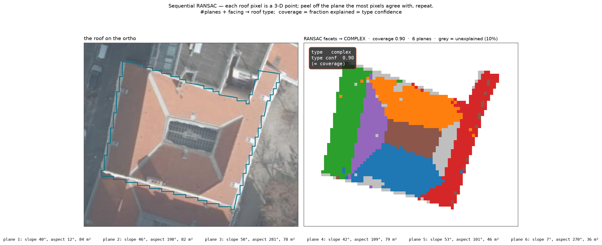

**Reading the figure.** The left is the roof on the photo — a large **hipped roof** with a solar array
over a central light well. On the right, RANSAC has peeled it into **6 coloured facets**. The four main
facets face roughly N/E/S/W (aspects 12°, 198°, 281°, 109°) — the four hip faces; facet 6 is a
near-flat patch (slope 7°, 36 m²) — the covered light-well platform the panels sit on, kept as roof by
the outer-ring fix from Block 7 rather than punched out as a hole. The **grey pixels are the ~10%
"unexplained"** — ridge lines, the base of the solar structure, edge noise — points that fit no plane
within 0.3 m. A clean hipped roof is *four* pitched facets; RANSAC found **six**, which exceeds the
four-facet `hipped` bucket and falls through to **complex, coverage 0.90**. That candidly shows two
things at once: the taxonomy's over-segmentation edge (a conceptually simple hipped roof labelled
"complex"), *and* the coverage staying honestly high (0.90) because most of the roof really is cleanly
planar. (Before the Block-7 hole fix this roof read 0.93 with the light-well area excluded; including
the covered platform added a low-slope facet and a little noise — a fair trade for not losing the
panels.)

**This is where "confidence is earned" stops being a slogan.** The `0.90` is a real measurement — the
share of the roof the planar model actually accounts for. A crisp gable comes out ~0.95+; a messy roof
cluttered with superstructures scores lower *because it is genuinely harder to describe as planes*, and
that lower number is information the downstream user should have. I'm reporting **confidence in the
planar description of the roof**, which is exactly what "roof type" is inferred from.

**Why RANSAC and not the per-pixel slope from Block 5, or one least-squares fit.** A single
least-squares plane through all roof points is meaningless on a multi-facet roof and gets yanked around
by every chimney. Per-pixel slope is noisy and doesn't *group* pixels into facets. RANSAC gives the
robust, outlier-resistant, facet-by-facet decomposition that a *type* judgement actually needs — and
it's seeded (`seed=42`) so the facets are reproducible.

**The failure mode.** (1) The taxonomy is deliberately **coarse — five buckets** — and `complex` is
the catch-all; an ornate but conceptually simple roof that over-segments into six facets also lands
there. (2) The **10° flat/pitched boundary** is a hard edge: a shallow roof hovering near 10° can flip
between `flat` and `mono-pitch` on DSM noise (a known wobble I'd replace with per-facet typing given
more time). (3) Greedy peeling can occasionally **split one noisy plane in two** or merge two nearly
co-planar facets; the 5 m² sliver filter and the 30-pixel minimum keep this in check. (4) `max_planes`
is capped at 6, so a truly baroque roof is summarised, not exhaustively parsed — acceptable, because
the goal is a *type*, not a CAD reconstruction.

> _Next: Block 9 — superstructures: the pixels that fit no plane but sit above one — chimneys, dormers,
> HVAC._

---

## Block 9 — Superstructures (`find_superstructures`)

Block 8 explained the roof as a small set of planes. **Block 9 is about what's left over.** Once you
have the planes, the roof itself is "solved" — so anything sticking up out of a plane is, by
definition, a *thing sitting on the roof*: a chimney, a dormer, a stair head, an HVAC unit. I don't
need a separate object detector for this; the plane model I already fit hands it to me for free.

**What it does.** Two steps, both cheap:

1. **`plane_base_image`** — for every roof pixel, evaluate its *nearest fitted plane* to get the height
   the roof "should" be at that spot. The **residual** = actual nDSM − that plane height. On a bare
   facet the residual is ≈ 0; where something is mounted, it spikes up.
2. Threshold the residual at **> 1 m**, label the connected blobs, and keep each as a superstructure —
   then classify it by size and prominence: `< 3 m² & > 1.2 m → chimney`, `≥ 6 m² → large_superstructure`,
   otherwise `dormer_or_small`. Two guards reject noise at both ends: **< 1 m² is dropped** (a single
   warm pixel), and **> 8 m above the plane is dropped** too — that's not a rooftop object, it's an
   adjacent *taller wing* of the building poking into the mask.

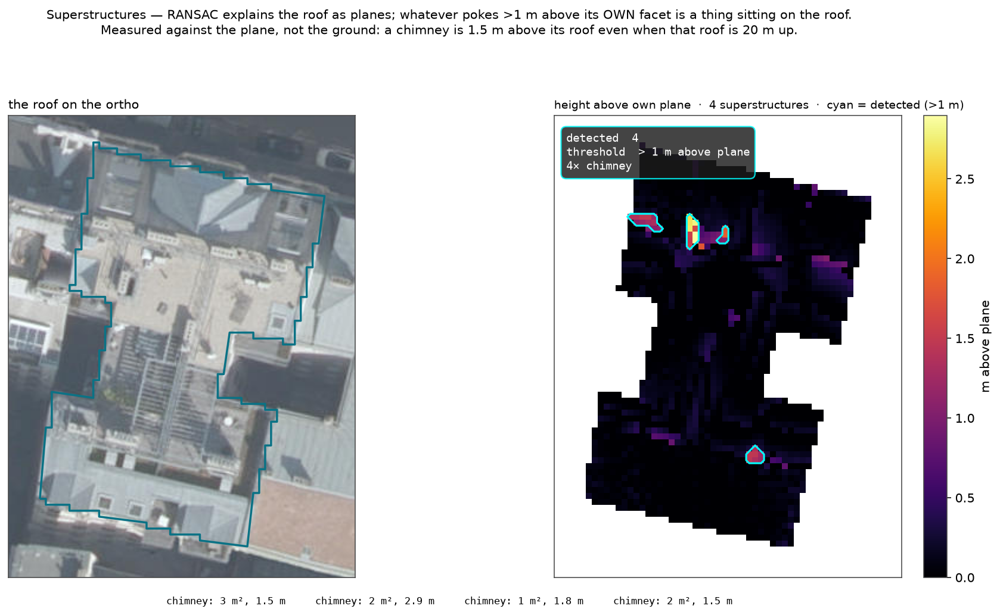

**Reading the figure.** Left is the roof on the photo; right is the **residual — height above each
pixel's own plane** — with the four detected objects outlined in cyan. Notice how **dark** the right
panel is: almost the whole roof sits within a few centimetres of its fitted plane, which is the visual
proof that Block 8's planes actually describe this roof well. Only the genuine protrusions light up.
The four blobs come back as **four chimneys** (3 m²/1.5 m, 2 m²/2.9 m, 1 m²/1.8 m, 2 m²/1.5 m) — three
clustered along the main ridge, one on the lower wing. The clustering is real and worth pointing at:
it's exactly the case where two adjacent stacks can merge into one blob (see failure mode).

**Why measured against the plane, not the ground — this is the whole point.** The naïve approach is to
threshold the raw nDSM: "anything above X metres is a superstructure." That fails immediately, because
a chimney on a 6-storey building is at ~20 m *absolute* — the same height as the roof next door. What
makes it a chimney is that it's **1.5 m above its own roof**, and only the residual-against-plane sees
that. Measuring against the fitted facet makes the detector **height-invariant**: it works identically
on a bungalow and a tower.

**Why not detect these on the photo instead.** You *could* try to spot chimneys/AC units as blobs in
the ortho — but the photo can't tell a dark HVAC unit from a dark stain or a shadow, and it has no
sense of "sticks up." Height is unambiguous about *up*. (The natural refinement — use height to *find*
each object, then CLIP its ortho crop to *name* it — is real and I've written it up under **Future
ideas**; it's deferred only because a 1–3 m² object is ~15 px in this ortho, below what CLIP can
resolve.)

**The failure mode.** (1) The **> 8 m guard is blunt** — a genuinely tall superstructure (a stair
tower or plant room rising more than 8 m above its roof) is discarded as an "adjacent wing." I chose to
under-report rather than fabricate a giant chimney, but it's a real miss on industrial roofs. (2)
**Touching objects merge** — two chimneys 30 cm apart become one labelled blob with one area and one
class, as very nearly happens with the ridge cluster here. (3) The **class is geometry-only** — a
1.5 m, 2 m² bump is called `chimney` whether it's actually a chimney, a vent stack, or a small
skylight housing; the shape is right but the *name* is a heuristic, which is precisely what per-object
CLIP would fix at higher resolution. (4) A tree branch overhanging the roof edge can, rarely, register
as a low bump — the roof-interior mask and the 1 m threshold keep this uncommon.

> _Next: Block 10 — geometric attributes: height, slope, and orientation measured over the mask, with
> circular statistics for orientation confidence._

---

## Block 10 — Geometric attributes (`geometric_attrs`)

This block reads the **numbers** off the roof: how tall it is, how steep, and which way it faces —
each measured over the Block-7 mask, in metres (EPSG:31256), each with its own earned confidence.
Three of the four are almost trivial; the fourth (orientation) is where the interesting maths lives.

**Height and slope — robust by construction.** Height is the **median nDSM** over the mask; slope is
the **median per-pixel slope**. The deliberate choice is **median, not mean**. A roof mask always
catches a few pathological pixels — a chimney spiking the height, a wall edge where the slope
momentarily reads 80°. A mean is dragged around by those; a median shrugs them off, because half the
pixels would have to be wrong to move it. So "roof height 18 m, slope 45°" is the *typical* pixel, not
an average contaminated by the handful of outliers the mask inevitably includes.

**Orientation — why you can't just average the angles.** Aspect is a *compass bearing*, and bearings
wrap: 350° and 10° are 20° apart, but their arithmetic mean is 180° — pointing exactly backwards. So
you can't treat aspect as ordinary numbers. The fix is **circular statistics**: turn each pixel's
aspect into a **unit vector** (`cos θ, sin θ`), sum all the vectors, and take the *direction of the
sum* as the mean orientation. Vectors don't care about the 360° seam, so 350° and 10° correctly
average to 0°.

**The bonus — the confidence falls out of the same maths for free.** The summed vector has a *length*
too. Normalise it by the pixel count and you get **R, the resultant length, between 0 and 1**:

- If every pixel faces the same way, the unit vectors all point together and stack up → **R near 1**.
- If they face all around the compass, the vectors cancel → **R near 0**.

So R *is* the orientation confidence — not a number I invented, but a direct measurement of how much
the pixels agree. This is the same "earned confidence" idea as RANSAC coverage in Block 8, applied to
direction instead of planarity.

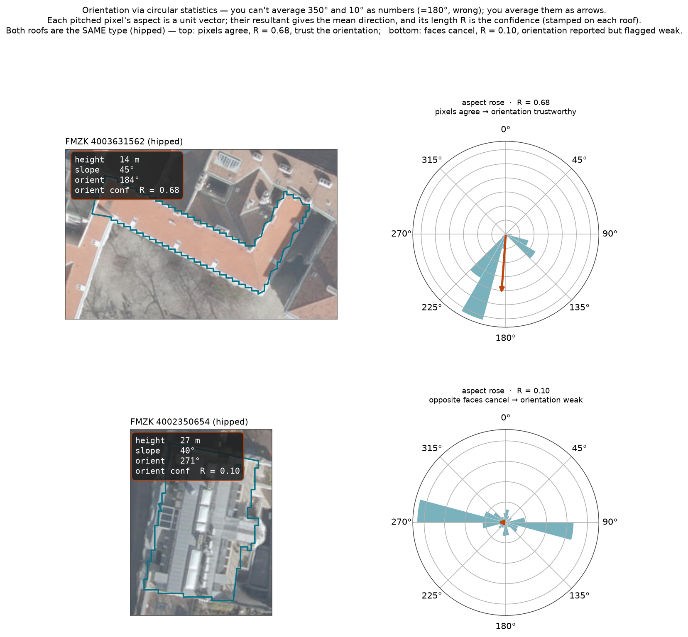

**Reading the figure.** Each row is one building: the **actual roof on the ortho** (with height, slope,
orientation and the orientation confidence R stamped on the image) next to a **compass rose** of its
pitched pixels' aspects (North up, clockwise), where the red arrow is the circular mean and its length
is scaled by R. Both roofs are the **same type — hipped** — yet their orientation confidence is
completely different, which is the whole point. **Top** (FMZK 4003631562): the aspect mass bunches to
the south-southwest, the arrow is long, **R = 0.68** — this roof has a genuine dominant facing, so
"orientation 184°" is trustworthy. **Bottom** (FMZK 4002350654): two opposite lobes — one facing ~270°
(west), one facing ~90° (east) — that **cancel**, leaving a stub arrow and **R = 0.10**. The code still
*reports* an orientation (271°), but R flags it as near-meaningless — which is exactly right, because a
symmetric roof genuinely has no single facing. **The type classifier can't tell these two apart; R
can.** That's why orientation ships with its own confidence rather than being folded into the type.

**Two more confidence terms, so nothing is asserted bare.** `valid_frac` = the fraction of mask pixels
that actually had finite height data — this is the **area confidence**, and it drops when the DEM has
holes over the building. `size_ok` = `clip(npix / 50, 0, 1)` — a gentle penalty that pulls confidence
down on tiny roofs where a handful of pixels can't support a stable median. The slope confidence is
`valid_frac × size_ok`: trust the slope only when the data is both present and plentiful.

**One deliberate suppression.** For a **flat** roof, orientation is meaningless — a flat plane faces
nowhere — so the record sets `orientation_deg = null` and orientation confidence `0.0` rather than
emitting a confident-looking but random bearing. Reporting "no orientation" is more honest than
reporting noise. (You can see the decision in `pipeline.py`: `orientation_deg` is only populated when
`rtype != "flat"`.)

**The failure mode.** (1) Per-pixel aspect from a DSM gradient is **intrinsically noisy** — even a
clean facet scatters ±30°, which is why R rarely approaches 1 on real roofs and why I lean on it
rather than pretending orientation is exact. (2) A roof with two equal opposite pitches (a symmetric
gable or hipped) will *always* produce a low R and a near-arbitrary mean — correct behaviour, but a
downstream user must actually *read* the confidence, not just the bearing. (3) Median height is the
height of the roof *surface* above ground, not eaves height or ridge height specifically — it's a
single representative number, not a full elevation profile.

> _Next: Block 11 — appearance via CLIP: material, solar PV, green roof, and condition from the ortho
> crop, with the softmax as confidence (and the honest terracotta / green-roof limitations)._

---

## Block 11 — Appearance via CLIP zero-shot (`appearance.clip_scores`)

Everything so far came from *geometry* — height and shape. But material, solar panels, vegetation and
condition are **appearance**: you have to *look* at the roof. This block is the only learned component,
and it's deliberately **zero-shot** — no training data, no labels, no roof-specific model to maintain.

**What it does.** CLIP is a model trained to put images and text in the same space, so you can score
how well an image matches a sentence. I hand it the **masked roof crop** (Block 7's mask reprojected
onto the ortho, off-roof pixels blacked out) and four small groups of competing text prompts —
material (`terracotta / metal / gravel / glass / green`), solar PV (`panels / no panels`), green roof
(`vegetation / bare`), condition (`clean / weathered`). For each group I take the cosine similarity of
the image against every prompt, and **softmax the group** — the winning label is the attribute, and
its softmax value is the confidence. Torch is imported lazily so the geometry-only paths (and the
tests) never need a deep-learning stack.

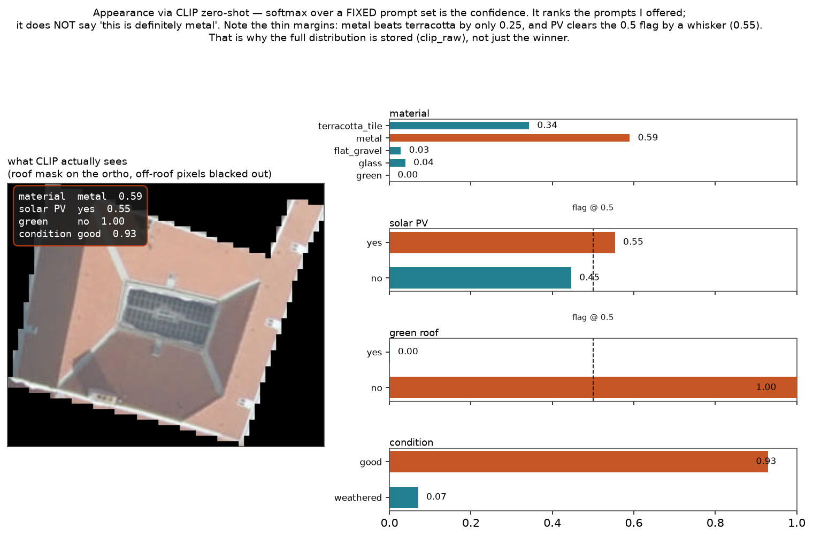

**Reading the figure.** On the left is *literally what CLIP sees* — the masked crop, black outside the
roof. Your eye reads it instantly: an orange **terracotta** hipped roof with a **solar array** over the
central light well. Now read the bars. Material: **metal 0.59, terracotta 0.34** — the top-1 is
*wrong*, and it's delivered with a confident-looking 0.59. Solar PV: **yes 0.55** — correct, but it
clears the 0.5 flag by a whisker. Green roof: **no 1.00** — correct and decisive. Condition: **good
0.93**. One image showing a decisive-correct call, a marginal-correct call, and a confident-*wrong*
call — which is the honest range of what a zero-shot classifier does, and the reason the confidence
needs careful handling.

### What the confidence number *is* — and, crucially, what it is *not*

This is the part that matters most for the task, so I'm explicit about it. The softmax is a **useful
relative ranking signal**, not a calibrated probability of correctness. Concretely:

- **It's closed-world — it ranks the prompts I offered, nothing else.** Softmax normalises over a
  *fixed* prompt list, so it answers "which of *these* sentences fits best?", never "what *is* this?".
  If the true material isn't among the prompts, CLIP still returns a confident-looking split among the
  wrong options. High confidence means "most like this prompt of the ones on offer," not "certainly
  this."
- **It is not calibrated.** `0.59` does **not** mean "59% of such calls are correct." There is no
  validation set behind it and no temperature calibration — the metal-vs-terracotta example is a live
  demonstration that a 0.59 can be flat wrong. Treat appearance confidences as **ordinal** (higher =
  more relatively confident), not as probabilities you can do arithmetic with.
- **The numbers are artificially sharpened.** CLIP's raw cosine similarities sit in a narrow band
  (~0.2–0.35); the code multiplies by the model's logit scale (100×) before softmax, which pushes
  results toward 0/1. So a printed `0.59 vs 0.34` corresponds to a *much* thinner real margin than it
  looks — the gap you should trust is small even when the top number looks big.
- **The margin matters more than the top value — which is why I store the whole distribution.** A
  top-1 of 0.59 with a runner-up at 0.34 (margin 0.25) is a genuinely *torn* call; 0.59 with the next
  at 0.05 is a clean one. The single stored confidence hides that, so the record also carries
  **`clip_raw`** — the full softmax for every group — precisely so a downstream user can see the metal
  0.59 / terracotta 0.34 tension instead of trusting a lone number. *(Added after inspection exposed
  the terracotta under-call — see the dead-ends ledger.)*
- **It's prompt-sensitive.** The score depends on the exact wording of the sentences; rephrasing
  "grey metal sheet roof" changes the number. I fixed a reasonable prompt set, but the confidence is
  conditional on those words — it is not an intrinsic property of the roof.
- **The input is out-of-distribution for CLIP.** CLIP was trained on internet photos — mostly
  ground-level, captioned. A **top-down aerial crop at 0.1 m with a black mask border** is unlike its
  training data, so both the label and its confidence are on shakier ground than the crisp decimal
  suggests. The black background itself is an artefact CLIP never saw in training.
- **The 0.5 flag is a hard cut on a soft number.** `solar_pv` / `green_roof` become booleans at
  `P(yes) > 0.5`. A roof at 0.55 (like this one) and a roof at 0.49 are treated as opposite answers
  despite being essentially the same evidence — so the *stored* `solar_pv: 0.55` confidence is what
  tells you it sat right on the fence. Read the confidence, not just the boolean.

### Per-attribute reliability — I don't claim these are equal

- **Material** — CLIP cleanly separates *metal / gravel / tile-vs-not*, but **systematically
  under-calls terracotta** against generic "red tile / metal," as the figure shows. Usable with the
  margin visible; not a substitute for a spectral classifier.
- **Solar PV** — the most reliable appearance call here (panels have a distinctive dark striped
  signature), and the one the Block-7 mask fix rescued from a guaranteed miss. Still, marginal at 0.55
  on this roof — trust it *with* the confidence.
- **Green roof** — **advisory only, structurally.** The ortho is **RGB with no near-infrared band**,
  so there is no true NDVI; CLIP guesses vegetation from colour alone, which confuses grey-green gravel
  and shadow with plants. Even a confident green score should be treated as a flag to verify, not a
  fact. A real answer needs the CIR ortho or the RGBI LiDAR.
- **Condition** — **weakest of the four.** "clean vs weathered" is subjective, and heavily confounded
  by sun angle, shadow and the single flight date. I report it but weight it lowest.

**The failure mode, in one line:** the confidence tells you how CLIP *ranked its own prompts on an
out-of-distribution crop*, not how likely it is to be right — so I surface the winner, the numeric
confidence, **and** the full `clip_raw` distribution, and I tier the attributes by trust rather than
pretending a 0.9 on condition means the same as a 0.9 on solar PV.

> _Next: Block 12 — assembling the per-building record and the confidence block that ties every
> attribute to its evidence._

---

## Block 12 — Record assembly (`extract_building`)

This is the orchestrator: it calls every earlier block in order for one building and fuses the results
into a single **self-describing JSON record**. The design goal is that the file needs *no external
document* to interpret — the values, their confidences, the data lineage, and the caveats all travel
together.

**What it does.** For one footprint: run the height mask (7), fit planes and read the type (8), find
superstructures (9), measure geometry (10), crop and run CLIP (11) — then assemble. The record has
two **parallel, same-keyed dicts**:

- **`roof`** — the answers (`type`, `material`, `slope_deg`, `orientation_deg`, `solar_pv`, …).
- **`confidence`** — exactly one number per answer.

plus **`clip_raw`** (the full CLIP distributions from Block 11), **`source_used`** (a one-line data
lineage string, per building), and **`notes`** (the standing caveats — nDSM-derived outline,
EPSG:31256 measurement, green-roof-has-no-NIR). A downstream consumer can threshold each attribute on
its own confidence and never has to come back and ask "how was this computed?".

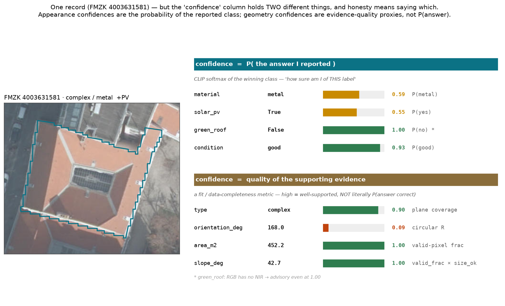

**Reading the figure — and the honest part: "confidence" holds *two different things*.** This is the
*actual* record for the solar building (FMZK 4003631581), with the building on the left and its
confidences on the right, deliberately **split into two groups**, because a single "confidence" column
would paper over a real distinction:

- **Confidence = P(the answer I reported).** The four **appearance** attributes (`material` 0.59,
  `solar_pv` 0.55, `green_roof` 1.00, `condition` 0.93) carry the CLIP softmax *of the winning class* —
  a genuine per-answer probability: "how sure am I of *this label*." A `green_roof: False` at `1.00`
  literally means "very confident it is *not* green."
- **Confidence = quality of the supporting evidence.** The four **geometry** attributes carry a
  *proxy*, not a probability that the value is correct: `type` = plane **coverage** (how planar the
  roof is), `orientation` = circular **R** (0.09 — how concentrated the aspects are), `area` and
  `slope` = **valid-pixel fraction** (how complete the measurement was). A high number here means the
  read is *well-supported by the data*, not that there's a 90 % chance the type is exactly "complex."

I make the split explicit in the figure rather than blur it, because conflating "probability of my
answer" with "how good was my evidence" is exactly the kind of quiet overclaim a reviewer should catch
— and calling it out is more credible than a uniform column that pretends all eight numbers are the
same currency. (Colour: green ≥ 0.60, amber ≥ 0.45, red below.)

**Within the appearance group I *did* enforce one consistent meaning — a bug I found and fixed here.**
Building this figure exposed a real inconsistency. Originally `solar_pv` and `green_roof` confidence
stored **`P(yes)`** always, while `condition` stored **`max(...)`** — the probability of the *reported*
class. That produced a genuinely misleading row: **`green_roof: False` with confidence `0.00`**, which
reads as "no confidence" but actually meant "very confident it's *not* green." I fixed all three to the
same rule — **confidence = probability of the class the record reports** (`max(scores.values())`, since
the flag is the arg-max). Now
`green_roof: False` carries **1.00** (high confidence it's not green), so **all four appearance
confidences** answer the same question — "how sure am I of the value I wrote?" — and `P(yes)` is still
fully recoverable from `clip_raw` for anyone who wants the raw detector score. (The geometry
confidences answer the *other* question — "how well-supported is this read?" — which is the two-kinds
distinction above; I keep them separate on purpose rather than force a false uniformity.)
_(See the dead-ends ledger.)_

**Self-describing by construction — the deliberate choices.** (1) **CRS is explicit per field**: the
polygon is exported in EPSG:4326 (portable lon/lat), while every area/length was measured in EPSG:31256
(metres) — the `notes` field says so, so nobody measures on the lon/lat ring by mistake. (2)
**`source_used` rides on every building**, not just the run — a record copied out of the file still
carries its provenance. (3) **The caveats are in the record**, not only in this write-up: a consumer
who never reads the docs still sees "green roof has no NIR, treat as advisory." (4) **The two-kinds
distinction is machine-readable**: a `confidence_kind` map ships alongside `confidence`, tagging each
number `p_reported_class` or `evidence_support`, so a program reading the raw JSON — not just a human
reading this figure — knows a `type` confidence is a support proxy, not a probability the label is
right.

**Why there is deliberately no single "overall confidence."** I don't collapse the eight numbers into
one score, because that would destroy exactly the information the design is built to preserve — a roof
can have rock-solid geometry (`type` 0.90, `slope` 1.00) and shaky appearance (`material` 0.59), and a
downstream user filtering for "reliable roof types" wants a *different* threshold than one filtering
for "confirmed solar." Per-attribute confidence lets each consumer set its own bar; an averaged score
would force one bar on everyone.

**The failure mode.** (1) The record is only as good as its parts — a wrong upstream call (the
terracotta under-read) flows straight through, which is *why* every field is chaperoned by a
confidence and `clip_raw`. (2) The thresholds that drive the flags (2 m roof cut, 0.5 PV flag, 10°
flat line) are **global constants** in `Config`, so one bad value silently shifts every building — I
keep them all named in one dataclass rather than scattered as magic numbers. (3) Confidence is
per-attribute but **not calibrated across attributes**: a `0.90` on `type` (a real coverage fraction)
and a `0.90` on `condition` (a sharpened CLIP softmax) are not the same currency, which is why the
appearance caveats from Block 11 matter when you read this table.

> _Next: Block 13 — outputs: the JSON file, the overview figure, the per-building panels, and the
> reproducibility/encoding details that make the repo runnable by a stranger._

---

## Block 13 — Outputs & reproducibility (`run`)

The last block turns per-building records into the **deliverable** and, just as importantly, makes the
whole thing **reproducible by a stranger** — the difference between "worked on my machine" and a repo
someone can clone and run.

**What it does.** `run(config)` builds the scene once (fetch footprints, sample, download DEM, compute
surfaces, fetch ortho), loops every chosen building through `extract_building`, and emits three
artifacts:

1. **`outputs/roof_attributes.json`** — the task deliverable: one record per building, keyed by FMZK
   id, each with the `roof` / `confidence` / `clip_raw` / `source_used` / `notes` structure from
   Block 12.
2. **`figures/attributes_overlay.png`** — the all-buildings overview.
3. **`figures/building_<id>.png`** — a static 3-panel detail (ortho, nDSM + superstructure contours,
   slope) for the first few buildings; the notebook carries the *interactive* versions.

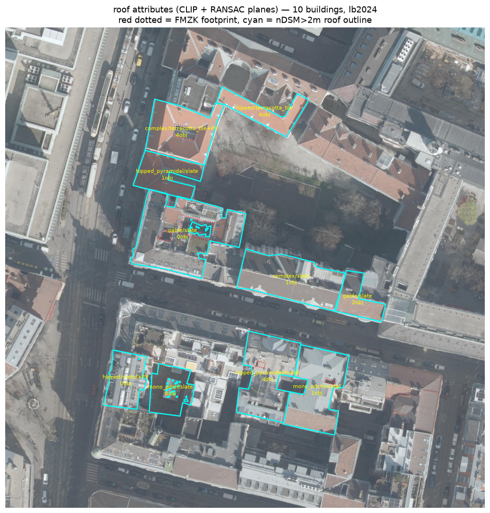

**Reading the figure.** This is the real output of a clean `python -m roofkit` run over the ten
Karlsplatz buildings. **Red dotted** = the FMZK footprint (the prior); **cyan** = the height-derived
roof outline (the actual detection); the **yellow label** is each roof's `type/material`, with `+PV` /
`+green` flags and the superstructure count. You can see the whole pipeline's judgement at a glance —
including the solar building (**`complex/metal+PV`**), which only carries that `+PV` because of the
outer-ring mask fix from Block 7. Where cyan sits tight inside red, the footprint was already good;
where it pulls in, height trimmed a courtyard or light well.

**Reproducibility — the deliberate engineering.** A model is only useful if the numbers can be
regenerated. The choices that make that true:

- **One `Config` dataclass** holds the box, the seed, and every threshold — so a run is fully specified
  by one object, and there are no magic numbers scattered through the code.
- **Seeded selection** (`seed=42`) fixes *which* buildings are sampled; a reviewer who clones and runs
  gets the same ten (given a stable WFS feature order — I state the exact edge of that guarantee in
  Block 3).
- **Pinned data versions** — the ortho is `lb2024`, an explicit year, not the moving `lb` "latest"
  alias, so the same run returns the same photo indefinitely.
- **Resumable, verified DEM download** — Vienna's DEM server drops connections mid-transfer, so tiles
  download with retry + resume and are length-checked before use; a truncated file fails loudly with a
  clear error instead of corrupting a run silently (the Block 4 war story).
- **Pinned `requirements.txt` + an 8-test suite** that exercises the geometry paths (RANSAC, masks,
  circular stats) without needing the deep-learning stack — torch is imported lazily, so the tests run
  fast and CI-friendly.
- **UTF-8 everywhere** — the inherited repo files were UTF-16, which silently killed `.gitignore` (so
  `data/` and caches would have been committed) and mis-rendered the README; I converted every text
  file to UTF-8 (the Block-13 encoding story in the ledger).

**The failure mode.** (1) The pipeline needs **live network access** to the Stadt-Wien WFS/WMTS/DEM
endpoints — an offline clone can't fetch data (mitigated by on-disk caching once fetched, but the first
run must reach the city servers). (2) The deliverable is **regenerated, not versioned** — the JSON and
figures are build products, so they must be re-run after any change to the mask, prompts, or confidence
logic (as they were here, after three such changes). (3) The static panels render only the **first few
buildings** for the file; full interactive inspection lives in `roof_attributes.ipynb` (`inspect_roof`),
which is the right split — a git-friendly deliverable plus a rich exploratory notebook.

> _That completes the block-by-block walkthrough. Block 0 (the conceptual three-source fusion diagram)
> sits at the top as the one-glance summary of everything above._

---

# Decisions, dead-ends, and what I ruled out

_This section is the honest ledger. The blocks above explain how the pipeline works; this explains
the judgement behind it — the choices I made on purpose, the approaches I tried that failed, and the
attributes I decided were not recoverable from open data and chose to flag rather than fake._

## Deliberate choices

Each of these was a fork in the road where I picked one path for a stated reason. The "rejected
alternative" column is the point — a choice with no alternative isn't a decision.

| Decision | Why | Rejected alternative | Block |
| --- | --- | --- | --- |
| Study area = **bounding box**, not a point | explicit, reproducible, the natural unit for city-scale tiling | click-a-point + guess the building/radius | 1 |
| **Three-source fusion** | no single source sees where + structure + appearance | one source, accept the blind spots | 0 |
| **EPSG 31256 to measure / 3857 to display / 4326 to export** | metres for real geometry; degrees are meaningless for area/tolerance | measure in the ortho's 3857 | 1, 5 |
| Raw-value **DEM GeoTIFFs**, not a WMS hillshade | I need metres to subtract DSM−DGM; can't do arithmetic on a picture | pretty pre-rendered relief tiles | 4 |
| **Query the authoritative sheet index** for tile names | never guess filenames; box straddled 2 sheets (35_4, 45_2) and it just worked | hard-code / pattern-guess sheet IDs | 4 |
| **Resumable `curl` + zip-integrity check** on DEM download | Vienna's server drops mid-stream; catch truncation early with a clear error | plain one-shot download | 4 |
| Pin the ortho year **`lb2024`**, not the moving `lb` alias | reproducibility — the same run gives the same photo next year | latest-alias for "freshest" | 6 |
| **True orthophoto** (not a standard aerial) | roof pixels sit on the footprint; no layover correction needed | uncorrected aerial + manual layover fix | 6 |
| Footprints filtered to **`F_KLASSE == 11`** + 60 m² cutoff | keep real buildings, drop non-building classes / slivers (37 → 14 on Karlsplatz) | take every FMZK polygon; or use OSM footprints | 2 |
| **Bilinear** for elevation, **nearest** for masks | height is continuous; a boolean mask must not be interpolated into fractional pixels | one resampling everywhere | 5 |
| **Height mask (nDSM > 2 m) as the detector** | real height-based detection; defines the pixel set for all downstream; gives 3-D free | a learned segmentation model (SAM) | 7 |
| **Sequential RANSAC** for structure | robust to superstructures/noise; groups pixels into facets; coverage = earned type confidence | one least-squares plane; per-pixel slope thresholds | 8 |
| **CLIP ViT-B/32 zero-shot** for appearance | no labelled roof data exists; softmax gives a usable confidence | hand-tuned colour rules; train a classifier | 11 |
| **Circular statistics** for orientation | aspect angles wrap at 360°; a linear mean is wrong | arithmetic mean of degrees | 10 |
| **Confidence earned per attribute**, not asserted | plane coverage / softmax / valid-pixel fraction are real evidence | one hand-set score per building | 12 |
| **Lazy torch import** | geometry code and the unit tests never touch a DL stack | import torch at module load | 11 |

## Dead-ends and failures (what I tried, what broke, what I did instead)

The path that matters most for judgement — these are the things that *didn't* work.

- **HSV colour heuristics for material & PV.** First attempt at appearance. Solar PV fired on **8 of
  10** roofs (false positives on dark bitumen and shadow); material collapsed to a meaningless
  "concrete_grey." → **Replaced with CLIP zero-shot**, which cut PV to a sensible 2/10 and produced
  real material calls. _Block 11._
- **FMZK courtyard contamination.** The footprint polygon encloses inner courtyards, so early
  attribute reads averaged roof + empty yard together. → Fixed by the **nDSM > 2 m height mask**,
  which samples only what's actually elevated. _Block 7._
- **SAM / learned segmentation — considered and rejected.** Tempting, but the task is *attribute
  extraction*, not instance masks, and a height threshold is a cleaner, explainable, training-free
  detector that also gives me 3-D structure for free. _Block 7._
- **DSM/ortho temporal gap.** On redeveloped land (Sonnwendviertel) the height model predates the
  photo by years, so a new building is missing from the nDSM. → I **detect the catchable case
  (near-zero height under a real footprint) and flag it** rather than emit a confident-but-wrong
  record. _Block 7._
- **QuickGELU weight mismatch.** CLIP loaded with the wrong activation variant, silently degrading
  scores with only a warning. → Fixed by matching the model name to the OpenAI weights
  (`ViT-B-32-quickgelu`). _Block 11._
- **Panels over a footprint hole, masked out → fixed.** Inspecting one building revealed the roof mask
  trusted FMZK's interior holes blindly: a PV array mounted over a mapped ~36 m² light-well was masked
  out **despite sitting at 11 m**, so CLIP never saw it (guaranteed `solar_pv=false`). → Switched the
  mask to the footprint's **outer ring ∧ height>2m**, letting height arbitrate openings. Verified
  end-to-end: the panels now survive to CLIP and **PV fires at 0.55** where it was previously
  impossible; genuine open courtyards still drop out (height ≈ 0). Tests still pass. _Block 7/8/11._
- **The UTF-16 `.gitignore` trap.** The inherited repo files were UTF-16, so `.gitignore` was dead
  (data/ and caches would have been committed) and the README mis-rendered. → Diagnosed via a hex
  dump, converted every text file to UTF-8. An engineering-reproducibility war story. _Block 13._
- **Inconsistent confidence semantics → `green_roof: False (0.00)`.** Rendering the record figure exposed
  that `solar_pv`/`green_roof` stored `P(yes)` while `condition` stored `max(...)` — so a `False` flag
  came out with confidence `0.00`, which reads as "no confidence" but actually meant "very sure it's
  *not* green." → Unified all appearance confidences to **probability of the reported class**
  (`max(scores.values())`), so `green_roof: False` now carries `1.00` and every field answers the same
  question, "how sure am I of the value I wrote?"; the raw `P(yes)` is still in `clip_raw`. Tests pass;
  applied to both `roofkit` and the notebook. _Block 11/12._

## What I ruled out as not recoverable

Deciding *not* to claim something is also a decision. From these three open sources:

- **Green roof** — the RGB ortho has **no NIR band**, so there is no true NDVI; CLIP can guess from
  colour but I ship it as **advisory only**. A real answer needs the CIR ortho or the 2023 RGBI
  LiDAR. _Block 11._
- **Fine material distinctions** — CLIP reliably separates metal / gravel / tile but **under-calls
  terracotta** vs. generic red tile. Reported, not hidden. _Block 11._
- **Thermal / insulation quality** — the only open thermal source (ECOSTRESS) is **≈ 70 m per pixel**,
  which spans many buildings; it is **not resolvable per roof** and I don't pretend otherwise. _Block 0/11._

_(The footprint-hole false negative — panels masked out over a mapped light well — was recoverable and
is now fixed; see the outer-ring entry in **Dead-ends** above rather than here.)_

## Future ideas

Extensions I designed but consciously deferred — each is scoped, and each has a *reason* it isn't in
the current build, not just "ran out of time."

- **Per-superstructure CLIP (height localises, ortho identifies).** Today `find_superstructures`
  finds each rooftop object as a height-residual blob (>1 m above its own plane) and labels it from
  geometry alone — area + height → `chimney / dormer_or_small / large_superstructure`. The natural
  upgrade is the *same fusion pattern I already use at roof level*: crop the ortho to each blob's mask
  and run CLIP against a superstructure vocabulary (`chimney / skylight / AC unit / dormer / roof
  hatch / vent`) to get an appearance-backed class instead of a geometric guess. **Why deferred — it's
  a resolution wall, not a scope cut:** a chimney is ~1–3 m², which at the ortho's 0.1 m/px is a crop
  only **~10–17 px across**, while CLIP ViT-B/32 ingests 224×224. Whole-roof crops work because
  they're hundreds of px with real texture; a 15 px blob upscaled to 224 is almost pure interpolation
  noise, so per-object CLIP would emit confident labels on unresolved patches — *worse* than the honest
  geometric bucket. At this scale the **height residual is the stronger discriminator** (1.5 m above
  its facet cleanly separates a chimney from a plant room). It becomes worthwhile the moment a sharper
  source is available (drone capture, or Vienna's higher-res oblique imagery), where a chimney is
  100+ px and CLIP has something to bite on. _Block 9._
- **Union FMZK with OSM footprints.** FMZK is authoritative but occasionally lags new construction;
  OSM is crowd-sourced and patchy but sometimes fresher. Production would *union* the two so each
  covers the other's gaps, with FMZK as the trusted base. _Block 2._
- **Stratified sampling for evaluation.** The demo draws a seeded random sample; a formal accuracy
  study would stratify by roof type so rare classes (e.g. the one roof with PV) aren't missed by
  chance. Production processes every footprint anyway — sampling exists only for the demo. _Block 3._
